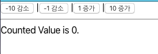
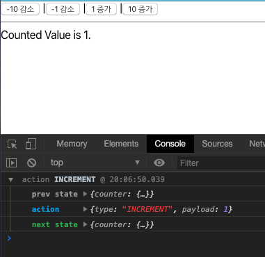
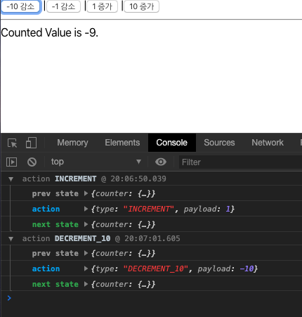

# redux 를 이용하여 Counter 만들기.

redux 를 이용하여 우선 Counter 를 만들어 보겠습니다.

## redux 기본 정책

redux 는 다음과 같은 원칙에 따라 개발 됩니다. 꼭 기억하세요.

1. 상태는 한곳에서 관리한다. (Source of Truth)
2. 상태는 불변이어야 한다.
3. 상태 변경은 순수 함수에서 이루어져야한다. (사이드 이펙트가 없도록)

## redux 구성요소 이해하기.

redux 는 다음과 같은 구조로 구성됩니다.

- store: 스토어는 관리해야할 state 를 저장하는 공통 상태관리 저장소입니다.
- actions: 액션 코드를 담는다. 액션은 특정 이벤트를 발생 시키는 역할을 합니다.
- reducers: 리듀서는 액션에 따라 상태의 변화를 일으키기 위해서 액션에 따른 변경을 수행합니다.
- containers: 컨테이너는 특정 컴포넌트에서 액션과, 리듀서를 연동시켜 주는 역할을 합니다.
- components: 컴포넌트는 redux 에서 리덕스가 연동되는 대상 컴포넌트입니다.

## 카운터를 위한 상태 만들기.

일반적으로 하나의 상태는 리듀서에 지정을 많이 합니다.

우리는 카운터를 만들것이기 때문에 reducers 폴더내에 counter.js 파일을 만들어 다음과 같이 만들어 줍니다.

이 초기 상태값은 이후 store 저장할 수 있도록 하겠습니다.

`reducers/counter.js`

```
const initialState = {
  num: 0
};


```

## 액션을 위한 타입 생성하기.

우리는 액션 타입을 1 증가, 10 증가, -1 감소, -10 감소 를 수행하도록 4개를 생성하겠습니다.

액션 타입은 actions 폴더 내에 actionTypes.js 파일을 만들고 다음과 같이 작성해 줍니다.

액션 타입은 사실 오타 방지를 위한 상수 값을 설정하는 역할을 합니다.

actions/actionTypes.js

```
// 1 증가 액션 타입
export const INCREMENT = "INCREMENT";
// 10 증가 액션 타입
export const INCREMENT_10 = "INCREMENT_10";
// -1 증가 액션 타입
export const DECREMENT = "DECREMENT";
// -10 증가 액션 타입
export const DECREMENT_10 = "DECREMENT_10";

```

## 액션 생성하기.

이번에는 액션을 생성해 보겠습니다.

액션은 함수라고 생각하시면 됩니다. 그런데 액션은 반드시 반환해야하는 객체 속성이 있습니다.

`{type: <actionType>, payload: <payload>}` 의 형태의 객체가 반환되어야 합니다. 그중 type 은 반드시 필요합니다 .

actions 폴더 내에 index.js 를 생성합니다.

actions/index.js

```
import {
  INCREMENT,
  INCREMENT_10,
  DECREMENT,
  DECREMENT_10
} from "./actionTypes";

export const increment = () => ({ type: INCREMENT, payload: 1 });
export const increment_10 = () => ({ type: INCREMENT_10, payload: 10 });
export const decrement = () => ({ type: DECREMENT, payload: -1 });
export const decrement_10 = () => ({ type: DECREMENT_10, payload: -10 });

```

보시는 바와 같이 increment, increment_10, decrement, decrement_10 을 생성했습니다.

그리고 우리는 actionTypes.js 에 정의한 액션 타입을 그대로 이용했습니다.

## reducer 생성하기.

리듀서를 이제 생성해 보겠습니다.

리덕스는 다음과 같이 동작합니다.

1. 특정 이벤트에서 action을 생성합니다.
2. 생성된 액션을 dispatch 를 통해서 전달 합니다.
3. 전달된 액션이 reducer 에 전달됩니다.
4. 리듀서에서 state 를 새로 복제하고, 해당값을 변경하고 반환합니다.
5. 반환된 state 가 store 에 반영이 됩니다.
6. 그리고 store 을 사용하는 컴포넌트에 변경된 사항이 반영이 됩니다.

reducers/counter.js 파일에 다음 내용을 추가해줍니다.

```
import {
  INCREMENT,
  INCREMENT_10,
  DECREMENT,
  DECREMENT_10
} from "../actions/actionTypes";

const initialState = {
  num: 0
};

const reducer = (state = initialState, action) => {
  switch (action.type) {
    case INCREMENT:
      return { num: state.num + action.payload };
    case INCREMENT_10:
      return { num: state.num + action.payload };
    case DECREMENT:
      return { num: state.num + action.payload };
    case DECREMENT_10:
      return { num: state.num + action.payload };
    default:
      return state;
  }
};

export default reducer;

```

리듀서는 순수 함수이어야 합니다. 즉, 직접 state 값을 변경하면 안됩니다.

위와 같이 단지 state 값을 가져와서 이용할 수 있습니다.

## 컴포넌트 만들기.

이제는 컴포넌트를 만들 차례입니다.

### Button 컴포넌트 만들기 

컴포넌트는 증가, 10 증가, -1 감소, -10 감소를 수행할 수 있는 Button 컴포넌트를 만들어 보겠습니다.

버튼 컴포넌트는 html 의 버튼 엘리먼트를 이용하고, 클릭시 동작할 액션, 그리고 버튼 텍스틀 전달해야합니다. 

우선 components 폴더 내에서 Button.js 파일을 하나 만듭니다. 

components/Buttons.js

```
import React from "react";

const Button = ({ title, actionFunc }) => (
  <button onClick={actionFunc}>{title}</button>
);

export default Button;

```

보시는바와 같이 props 로 title, actionFunc 를 받습니다. 

그리고 onClick 클릭이 되면 actionFunc 가 동작하도록, 그리고 버튼은 title 을 노출하도록 한다. 

## 컨테이너 생성하기. 

### 버튼 컨테이너를 생성하기

버튼 컨테이너는 4개의 버튼과 이전에 만든 actions 를 연동하도록 하는 컨테이너입니다. 

이 컨테이너를 이용하여 action 이벤트를 생성합니다. 

container 폴더 하위에 ButtonContainer.js 를 생성합니다. 

```
import React from "react";
import { connect } from "react-redux";
import { increment, increment_10, decrement, decrement_10 } from "../actions";
import Button from "../components/Buttons";

const ButtonContainer = ({
  increment,
  increment_10,
  decrement,
  decrement_10
}) => (
  <>
    <Button title="-10 감소" actionFunc={decrement_10} /> |
    <Button title="-1 감소" actionFunc={decrement} /> |
    <Button title="1 증가" actionFunc={increment} /> |
    <Button title="10 증가" actionFunc={increment_10} />
  </>
);

const mapDispatchToProps = {
  increment: increment,
  increment_10: increment_10,
  decrement: decrement,
  decrement_10: decrement_10
};

export default connect(null, mapDispatchToProps)(ButtonContainer);

```

일단 actions 에서 액션들을 임포트 했습니다. 

그리고 mapDispatchToProps 를 함수를 하나 생성하고, 결과값으로 4개 액션을 반환합니다. 

그리고 export default connect(null, mapDispatchToProps)(ButtonContainer); 을 통해서 ButtonContainer 에 액션을 props 에 매핑해서 전달합니다. 

ButtonContainer 함수형 컴포넌트에 props 에 전달한 값을 

const ButtonContainer = ({
  increment,
  increment_10,
  decrement,
  decrement_10
})

을 통해서 전달하도록 합니다. 

그리고 하위에 버튼을 생성했습니다. 

### CountContainer 를 생성하기 

이제는 state 값을 노출하기 위한 컨테이너를 생성하겠습니다. 

container 폴더 하위에 CountContainer.js 파일을 생성합니다. 

```
import React from "react";
import { connect } from "react-redux";

const Count = ({ num }) => <span>Counted Value is {num}.</span>;

function mapStateToProps(state) {
  return { num: state.counter.num };
}

export default connect(mapStateToProps, null)(Count);

```

버튼과 동일합니다. 

이 컨테이너에서는 

function mapStateToProps(state) {
  return { num: state.counter.num };
}

을 통해서 state 내부에 counter 리듀서 내의 num 의 상태를 num 키로 매핑합니다. 

connect(mapStateToProps, mapDispatchToProps) 의 형식이므로, 여기서는 dispatch 가 필요없기 때문에 connect(mapStateToProps, null) 의 형태로 사용합니다. 

## CombineReducer 로 리듀서들 취합하기. 

이제는 reducers/index.js 파일을 생성하고, 리듀서들을 하나로 통합하는 것을 확인해 보겠습니다. 

reducers 하위 index.js 파일에 다음과 같이 작성합니다. 

```
import { combineReducers } from "redux";
import counter from "./counter";

export default combineReducers({ counter });

```

보시는 바와 같이 combineReducers 는 리듀서를 여러개 통합할 수 있습니다. 

그럼 state.counter 의 형태로 리듀서 이름에 접근할 수 있습니다. 

그래서 위 mapStateToProps 에서 state.counter.num 으로 상태 값에 접근한 것입니다. 

## 화면에 배치하기. 

이제는 버튼과 카운터 컴포넌트를 화면에 배차해 보겠습니다. 

메인 컴포넌트인 App.js 파일을 다음과 같이 작성합니다. 

```
import React from "react";
import ButtonContainer from "./containers/ButtonContainer";
import CountContainer from "./containers/CountContainer";

function App() {
  return (
    <div>
      <ButtonContainer />
      <hr />
      <CountContainer />
    </div>
  );
}

export default App;

```

보시는바와 같이 별 내용은 없고 컴포넌트만 배치 했습니다. 

버튼 컨테이너가 먼저 나오고, 가로한줄 나오고, 상태 값을 노출하는 CountContainer 을 보여줍니다. 

## 스토어 생성하고, 루트 컴포넌트에 주입하기

이제는 지금까지 만든 만든 리듀서를 이용하여 스토어를 생성하고, 루트 컴포넌트에 주입하여 하위 모든 컴포넌트들이 사용할 수 있도록 해보겠습니다. 

src 하위에 index.js 파일을 다음과 같이 작성해줍니다. 

```
import React from "react";
import ReactDOM from "react-dom";
import "./index.css";
import App from "./App";
import * as serviceWorker from "./serviceWorker";

import { createStore, applyMiddleware } from "redux";
import { Provider } from "react-redux";
import { logger } from "redux-logger";

import reducer from "./reducers";

const store = createStore(reducer, applyMiddleware(logger));

ReactDOM.render(
  <Provider store={store}>
    <App />
  </Provider>,
  document.getElementById("root")
);

// If you want your app to work offline and load faster, you can change
// unregister() to register() below. Note this comes with some pitfalls.
// Learn more about service workers: https://bit.ly/CRA-PWA
serviceWorker.unregister();

```

우리가 추가한 내용은 redux 에서 createStore, applyMiddleware 를 임포트 했습니다. 

우선 여기서 중요한 것은 createStore 입니다. 리덕스가 관리하는 상태가 store 이며 이러한 스토어를 생성하는 함수입니다. 

그리고 Provider 는 스토어를 루트 컴포넌트에 주입시켜줍니다. 그럼 루트 컴포넌트 하위의 자식 컴포넌트들에서 컨테이너를 통해서 사용할 수 있게 props 에 주입해줄 수 있습니다. 

이전 코드로 확인하셨죠? connect 이용하는방법으로. 

그리고 통합한 리듀서를 임포트 하였습니다. 

import reducer from "./reducers";

재료가 모였으니 이제 스토어를 다음 코드로 생성합니다. 

```
const store = createStore(reducer, applyMiddleware(logger));

```

이렇게 되면 store 내에는 state.counter 로 접근할 수 있는 우리가 만든 상태를 스토어에 저장하게 됩니다. 

참고로 applyMiddleware(logger) 은 없어도 됩니다. 

미들웨어는 나중에 구체적으로 설명하겠습니다. 여기서는 그냥 로깅을 위한 미들웨어를 적용했다고 생각해주시면 됩니다. 

마지막으로 루트 컴포넌트에 적용합니다. 

```
ReactDOM.render(
  <Provider store={store}>
    <App />
  </Provider>,
  document.getElementById("root")
);
```

Provider store 로 전달했습니다. 

## 테스트 화면. 

초기상태 



1 증가 버튼 클릭시 


-10 감소 버튼 클릭시 


# 결론

지금까지 리덕스에 대해서 살펴 보았습니다. 

리덕스는 컴포넌트 계층이 깊어질때 이용하면 복잡한 코드를 작성하지 않고도 최상위에서 상태를 관리하고, 하위 컴포넌트들이 이를 적용할 수 있도록 동작하게 만들 수 있는 것입니다. 

예전에는 리덕스를 남발하지 말라는 말이 맣았지만, 최근에는 기본적으로 redux 를 사용하는 것을 권장합니다. 

잘 익혀서 기본으로 적용하길 적극 추천합니다. 


